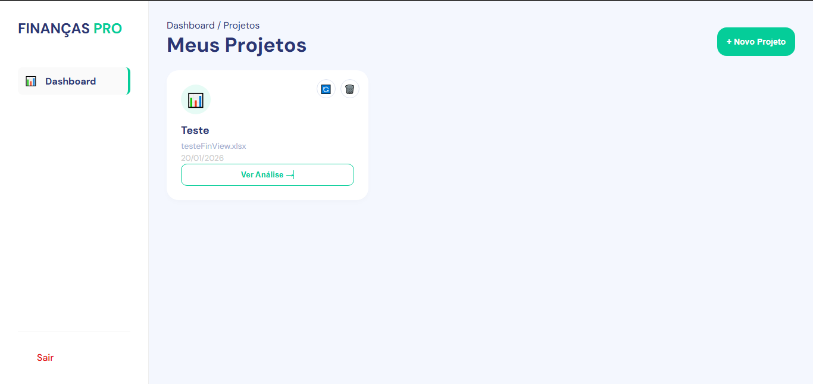
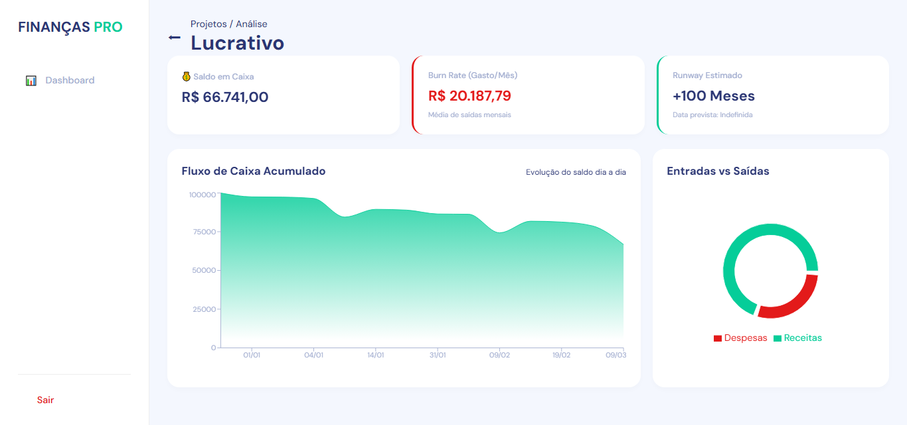
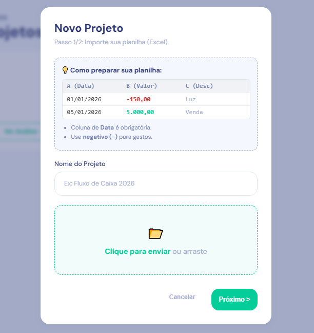

# 📊 FinView - Análise Financeira & Runway de Startups


> **FinView** é uma plataforma Full Stack para análise de saúde financeira. O sistema processa planilhas Excel (fluxo de caixa) e gera indicadores estratégicos como **Runway**, **Burn Rate** e **Previsão de Caixa** através de dashboards interativos.

---

## 📸 Demonstração




  

---

## 🛠️ Tecnologias Utilizadas

O projeto foi desenvolvido utilizando as melhores práticas de mercado, garantindo performance e escalabilidade.

### **Backend (Golang)**
- **Linguagem:** Go (Golang) 1.23+
- **Framework Web:** Gin Gonic (Alta performance HTTP)
- **ORM:** GORM (Gerenciamento de banco de dados e migrações)
- **Processamento de Dados:** Excelize (Leitura otimizada de arquivos .xlsx)
- **Arquitetura:** Clean Architecture (Separação de responsabilidades em camadas)

### **Frontend (React)**
- **Library:** React.js + Vite
- **Estilização:** CSS Modules / Responsivo (Mobile First)
- **Gráficos:** Recharts (Visualização de dados)
- **HTTP Client:** Axios com Interceptors
- **State Management:** Context API (Gerenciamento de Toasts e Autenticação)

### **Infraestrutura & DevOps**
- **Containerização:** Docker & Docker Compose
- **Web Server:** Nginx (Reverse Proxy para o Frontend)
- **Imagens:** Multi-stage builds baseados em Alpine Linux (Imagens finais leves)
- **Banco de Dados:** SQLite (Persistência via Docker Volumes)

---

## 🏛️ Arquitetura do Projeto

O Backend segue os princípios da **Clean Architecture**, visando desacoplamento e testabilidade.

```bash
backend/
├── cmd/                # Entrypoints da aplicação
├── internal/
│   ├── analysis/       # Lógica de domínio (Cálculos de Runway/Burn Rate)
│   ├── projects/       # Módulo de Projetos
│   │   ├── controller/ # Handlers HTTP
│   │   ├── service/    # Regras de Negócio
│   │   └── model/      # Entidades do Banco
│   └── user/           # Módulo de Usuários
├── database/           # Arquivo SQLite (Mapeado via Volume)
└── uploads/            # Armazenamento temporário de arquivos
```

🚀 Como Rodar o Projeto
A maneira mais simples e recomendada é utilizando Docker. Você não precisa ter Go ou Node instalados, apenas o Docker.

Pré-requisitos
Docker e Docker Compose instalados.

Passo a Passo
Clone o repositório:

```Bash

git clone https://github.com/vitor-gbst/FinView.git
cd finview
Configure as Variáveis de Ambiente: Crie um arquivo .env na pasta backend/ baseado no exemplo:
```
```Bash

cp backend/.env.example backend/.env
(O arquivo .env.example já contém configurações padrão seguras para desenvolvimento).

Suba os Containers: Na raiz do projeto, execute:
```
```Bash

docker-compose up --build
O Docker irá baixar as dependências, compilar o Go, buildar o React e configurar o Nginx automaticamente.

Acesse a Aplicação:

Frontend: http://localhost:3000

API Backend: http://localhost:8080
```
✨ Funcionalidades
- Autenticação: Login e Cadastro de usuários com JWT.

- Upload de Arquivos: Suporte a arquivos Excel (.xlsx, .xls) com validação.

- Mapeamento Inteligente: O usuário define quais colunas representam Data e Valor (digitando o seu respectivo nome).

- Análise Financeira:

  - Cálculo automático de Burn Rate (Gasto médio mensal).

  - Estimativa de Runway (Tempo de vida da empresa).

  - Gráfico de Fluxo de Caixa Acumulado.

  - Gráfico de Pizza (Entradas vs Saídas).

- Responsividade: Layout adaptável para Desktop, Tablets e Celulares.

🤝 Contato
Desenvolvido por Vitor Gabriel.
  Linkedin: https://www.linkedin.com/in/vitor-gabriel-brandao/
